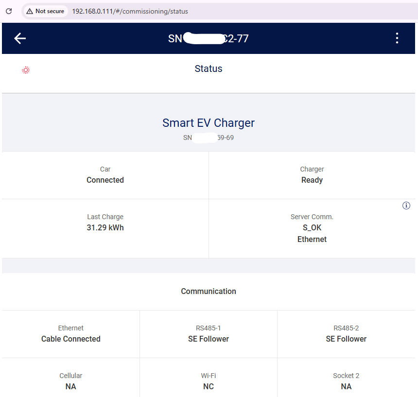

# SolarEdge EV Charger (Australia) - Home Assistant Integration

A custom component for Home Assistant to integrate **SolarEdge EV Charger (AU)** devices using the local Protobuf status endpoint. This solution was tested with the Australian version of the SolarEdge EV Charger (model number starting with `EVSA-32A-...`).

<div align="center">
  
</div>

## Features

- **Seamless Discovery & Polling**: Automatically locates your charger and continuously retrieves updates on car connection status, charger state, power, energy, and errors.
- **Enhanced Sensor Compatibility**: Sensors include `DeviceClass` and `StateClass` attributes to meet Home Assistant’s energy dashboard requirements and sensor metric standards.
- **Improved Device Information**: The charger’s serial number appears on the Device Info page for accurate hardware identification, accompanied by useful diagnostic data.
- **Streamlined Configuration**: The configuration process has been refined to simplify both initial setup and later adjustments.
- **Customizable Options**: Adjust the polling interval and select your preferred unit system (W/Watt-hours or kW/Kilowatt-hours) using the Options flow.

## Installation

### HACS Installation (Recommended)

1. In Home Assistant, go to **HACS → Integrations**.
2. Click the **+ Explore & Add Repositories** button.
3. Search for **SolarEdge EV Charger (Australia)**.
4. Click **Download** to install the integration.
5. Restart Home Assistant.

### Manual Installation

1. Copy or clone this repository into your Home Assistant `custom_components` folder:
   `<config_directory>/custom_components/solaredge_ev_charger_au`
2. Restart Home Assistant.

## Setup

1. Navigate to **Settings → Devices & Services → + Add Integration**.
2. Search for **"SolarEdge EV Charger (Australia)"**.
3. Enter the charger’s IP address or hostname, and set the polling interval (in seconds).

## Options

After installation, open the **Options** flow to:
- Modify the IP address or adjust the scanning interval.
- Choose between Watts/Watt-hours (W/Wh) or Kilowatts/Kilowatt-hours (kW/kWh) for displayed values.

## Available Sensors

The integration offers the following sensors with enhanced attributes for better integration:

1. **`solaredge_ev_charger_car_status`**
   - **Description**: Indicates the car's connection and charging state.
   - **Possible States**: `disconnected`, `connected`, `charging`, `rfid`, `undefined`.

2. **`solaredge_ev_charger_charger_status`**
   - **Description**: Represents the operational state of the EV charger.
   - **Possible States**: `ready`, `initializing`, `active`, `boost`, `excess_pv`, `off`, `error`.

3. **`solaredge_ev_charger_charge_power`**
   - **Description**: Displays the current charging power.
   - **Units**: Watts (W) or Kilowatts (kW).

4. **`solaredge_ev_charger_session_energy`**
   - **Description**: Reports the total energy delivered during the current charging session.
   - **Units**: Watt-hours (Wh) or Kilowatt-hours (kWh).

5. **`solaredge_ev_charger_error`**
   - **Description**: Provides error information including codes and subsystem details.

6. **`solaredge_ev_charger_charger_sn`**
   - **Description**: The serial number of the EV charger, used on the Device Info page for accurate hardware identification.

7. **`solaredge_ev_charger_inverter_sn`**
   - **Description**: The inverter's serial number, retained for backward compatibility even though the Device Info prioritizes the charger’s serial number.

## Home Assistant Sensors

After integration, all entities appear under **Settings → Devices & Services → Entities**.

### Example Entity List

- `solaredge_ev_charger_car_status`
- `solaredge_ev_charger_charger_status`
- `solaredge_ev_charger_charge_power`
- `solaredge_ev_charger_session_energy`
- `solaredge_ev_charger_error`
- `solaredge_ev_charger_charger_sn`
- `solaredge_ev_charger_inverter_sn`

## Additional Notes

Recent improvements align the integration with Home Assistant best practices:

- **Sensor Enhancements**: The inclusion of `DeviceClass` and `StateClass` properties ensures sensors deliver meaningful data for energy tracking and automation.
- **Device Info Update**: The Device Info page now uses the charger’s serial number as the primary identifier, providing a precise reflection of your hardware.
- **Configuration Refinements**: Settings and options have been restructured for a smoother setup and reconfiguration experience, optimizing both storage and performance.

## ⚠️ Important: SolarEdge EV Charger vs. SolarEdge Inverter

**This integration is ONLY for the SolarEdge EV Charger, NOT the SolarEdge Inverter.**

These are two separate devices with different IP addresses:

| Device                   | Purpose              | IP Address                  | Web Interface          |
|--------------------------|----------------------|-----------------------------|------------------------|
| **SolarEdge Inverter**   | Solar power inverter | Usually `192.168.xxx.xxx`   | Uses Modbus/API        |
| **SolarEdge EV Charger** | EV charging station  | Separate IP on your network | Uses protobuf endpoint |

**Common mistake**: Users often enter the inverter's IP address instead of the charger's IP address. Make sure you are using the **EV Charger's IP address**, not the inverter's.

## Troubleshooting

### Before Installing the Integration

Before adding this integration to Home Assistant, verify that your EV Charger's web interface is accessible:

#### Step 1: Find Your EV Charger's IP Address

1. Check your router's DHCP client list or device list
2. Look for a device named similar to "SolarEdge-EV" or with the charger's serial number
3. Note the IP address (e.g., `10.0.0.17`, `192.168.1.xxx`)
4. **Important**: This should be a DIFFERENT IP address than your SolarEdge Inverter

#### Step 2: Test Web Interface Access

Open your web browser and navigate to:

```
http://YOUR_CHARGER_IP/#/commissioning/status
```

**Example**: `http://10.0.0.17/#/commissioning/status`

✅ **Success**: You should see a page titled "Smart EV Charger" showing:
- Serial Number (SN)
- Car connection status (Connected/Disconnected)
- Charger status (Ready/Charging)
- Last charge energy
- Server communication status
- Communication settings (Ethernet, RS485-1, RS485-2, etc.)

<div align="center">
  
  <br>
  <em>Example of a working SolarEdge EV Charger web interface at http://192.168.0.111/#/commissioning/status</em>
</div>

❌ **Failure**: If the page doesn't load, the integration will NOT work. See common issues below.

### Common Issues and Solutions

#### Issue 1: "Unable to connect. Please check the IP address"

**Possible causes**:
1. **Wrong IP address**: You may have entered the inverter's IP instead of the charger's IP
   - **Solution**: Double-check you're using the EV Charger's IP, not the inverter's
   
2. **Charger not on network**: The charger is not connected to your local network
   - **Solution**: Verify the charger's network connection (Ethernet cable or WiFi)
   - Check your router to confirm the device is connected
   
3. **Network/firewall issue**: Your network may be blocking access
   - **Solution**: Try accessing `http://YOUR_CHARGER_IP/#/commissioning/status` from a browser on the same network
   - If this doesn't work, the integration won't work either

4. **Charger web interface disabled**: Some configurations may have the web interface disabled
   - **Solution**: Check your charger's communication settings. The "Server Comm." should show Ethernet or WiFi connectivity

#### Issue 2: Only Serial Number Shows, All Other Data is "n/a" or "Unknown"

**Possible causes**:
1. **Outdated firmware**: The charger firmware may be too old or incompatible with the integration
   - **Solution**: 
     - **Update your charger firmware to the latest version** - This is the most common fix for this issue
     - Check the SolarEdge support website or contact your installer for firmware updates
     - Access your charger's web interface to check the current firmware version
     - After updating firmware, restart Home Assistant and reconfigure the integration

2. **Partial connectivity**: The integration can reach the charger but data parsing is failing
   - **Solution**: 
     - Verify you can fully load the web interface at `http://YOUR_CHARGER_IP/#/commissioning/status`
     - Check Home Assistant logs for specific errors
     - Enable diagnostics and submit an issue with the diagnostic file

3. **Charger firmware version incompatibility**: Different firmware versions may use different data formats
   - **Solution**: Report your charger model and firmware version as a GitHub issue if updating firmware doesn't resolve the issue

#### Issue 3: Can't Ping the Charger IP Address

**Note**: Some chargers may not respond to ICMP ping requests while still being accessible via HTTP.

- **Test HTTP access first**: Try `http://YOUR_CHARGER_IP/#/commissioning/status` in a browser
- If the web page loads but ping fails, the integration should still work

#### Issue 4: Charger Connected via RS485-2 (Not Ethernet/Wi-Fi)

**Important**: This integration requires the charger to be accessible via **Ethernet or Wi-Fi**, NOT just RS485.

If your charger's "Server Comm." shows only RS485 communication:
1. Connect the charger to your network via Ethernet cable or Wi-Fi
2. The charger can maintain both RS485 (for inverter communication) AND Ethernet/Wi-Fi (for this integration) simultaneously
3. Check your charger's commissioning settings to enable network connectivity

### Testing Checklist

Before opening a GitHub issue, please verify:

- [ ] I am using the **EV Charger's IP address**, not the inverter's IP address
- [ ] I can access `http://MY_CHARGER_IP/#/commissioning/status` in a web browser
- [ ] The web page shows "Smart EV Charger" with status information
- [ ] The charger is connected via Ethernet or Wi-Fi (not just RS485)
- [ ] **I have updated the charger firmware to the latest version**
- [ ] I have enabled diagnostics and can provide the diagnostic file
- [ ] I have checked Home Assistant logs for error messages

### Getting Help

If you've completed the testing checklist and still have issues:

1. Enable diagnostics for the integration
2. Open an issue on [GitHub](https://github.com/niktest/solaredge_ev_charger_au/issues)
3. Include:
   - Your charger model number (e.g., `SE-EV-SA-AU-32`)
   - **Your charger firmware version** (visible in the web interface)
   - Screenshot of the charger's web interface at `http://YOUR_IP/#/commissioning/status`
   - The diagnostic file from Home Assistant
   - Home Assistant logs showing any errors

## Technical Details

**How This Integration Works**:
- SolarEdge EV Chargers do not have a public API or Modbus interface
- This integration uses reverse-engineered protobuf data from the charger's web interface
- It accesses the `/web/v1/status` endpoint to retrieve binary data
- The data is decoded and presented as Home Assistant sensors

## Known Limitations

- The integration requires local access to the charger’s web endpoint (`/web/v1/status`).

## Support

For bugs or feature requests, please open an issue in this repository.  
Code owner: [@niktest](https://github.com/niktest/solaredge_ev_charger_au)
