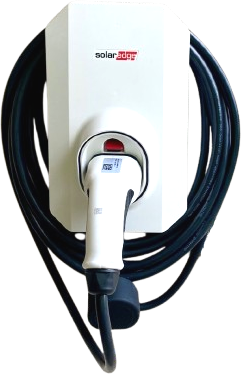

# SolarEdge EV Charger (Australia) - Home Assistant Integration

A custom component for Home Assistant to integrate **SolarEdge EV Charger (AU)** devices using the local Protobuf status endpoint. This solution was tested with the Australian version of the SolarEdge EV Charger (model number starting with `EVSA-32A-...`).

  

## Features

- **Seamless Discovery & Polling**: Automatically locates your charger and continuously retrieves updates on car connection status, charger state, power, energy, and errors.
- **Enhanced Sensor Compatibility**: Sensors include `DeviceClass` and `StateClass` attributes to meet Home Assistant’s energy dashboard requirements and sensor metric standards.
- **Improved Device Information**: The charger’s serial number appears on the Device Info page for accurate hardware identification, accompanied by useful diagnostic data.
- **Streamlined Configuration**: The configuration process has been refined to simplify both initial setup and later adjustments.
- **Customizable Options**: Adjust the polling interval and select your preferred unit system (W/Watt-hours or kW/Kilowatt-hours) using the Options flow.

## Installation

### HACS Installation (Recommended)

1. In Home Assistant, go to **HACS → Integrations**.
2. Click the **+ Explore & Add Repositories** button.
3. Search for **SolarEdge EV Charger (Australia)**.
4. Click **Download** to install the integration.
5. Restart Home Assistant.

### Manual Installation

1. Copy or clone this repository into your Home Assistant `custom_components` folder:
   `<config_directory>/custom_components/solaredge_ev_charger_au`
2. Restart Home Assistant.

## Setup

1. Navigate to **Settings → Devices & Services → + Add Integration**.
2. Search for **"SolarEdge EV Charger (Australia)"**.
3. Enter the charger’s IP address or hostname, and set the polling interval (in seconds).

## Options

After installation, open the **Options** flow to:
- Modify the IP address or adjust the scanning interval.
- Choose between Watts/Watt-hours (W/Wh) or Kilowatts/Kilowatt-hours (kW/kWh) for displayed values.

## Available Sensors

The integration offers the following sensors with enhanced attributes for better integration:

1. **`solaredge_ev_charger_car_status`**
   - **Description**: Indicates the car's connection and charging state.
   - **Possible States**: `disconnected`, `connected`, `charging`, `rfid`, `undefined`.

2. **`solaredge_ev_charger_charger_status`**
   - **Description**: Represents the operational state of the EV charger.
   - **Possible States**: `ready`, `initializing`, `active`, `boost`, `excess_pv`, `off`, `error`.

3. **`solaredge_ev_charger_charge_power`**
   - **Description**: Displays the current charging power.
   - **Units**: Watts (W) or Kilowatts (kW).

4. **`solaredge_ev_charger_session_energy`**
   - **Description**: Reports the total energy delivered during the current charging session.
   - **Units**: Watt-hours (Wh) or Kilowatt-hours (kWh).

5. **`solaredge_ev_charger_error`**
   - **Description**: Provides error information including codes and subsystem details.

6. **`solaredge_ev_charger_charger_sn`**
   - **Description**: The serial number of the EV charger, used on the Device Info page for accurate hardware identification.

7. **`solaredge_ev_charger_inverter_sn`**
   - **Description**: The inverter's serial number, retained for backward compatibility even though the Device Info prioritizes the charger’s serial number.

## Home Assistant Sensors

After integration, all entities appear under **Settings → Devices & Services → Entities**.

### Example Entity List

- `solaredge_ev_charger_car_status`
- `solaredge_ev_charger_charger_status`
- `solaredge_ev_charger_charge_power`
- `solaredge_ev_charger_session_energy`
- `solaredge_ev_charger_error`
- `solaredge_ev_charger_charger_sn`
- `solaredge_ev_charger_inverter_sn`

## Additional Notes

Recent improvements align the integration with Home Assistant best practices:

- **Sensor Enhancements**: The inclusion of `DeviceClass` and `StateClass` properties ensures sensors deliver meaningful data for energy tracking and automation.
- **Device Info Update**: The Device Info page now uses the charger’s serial number as the primary identifier, providing a precise reflection of your hardware.
- **Configuration Refinements**: Settings and options have been restructured for a smoother setup and reconfiguration experience, optimizing both storage and performance.

## Known Limitations

- The integration requires local access to the charger’s web endpoint (`/web/v1/status`).

## Support

For bugs or feature requests, please open an issue in this repository.  
Code owner: [@niktest](https://github.com/niktest/solaredge_ev_charger_au)
